


 

  

&nbsp;

  

**A mod manager made for GTA IV: The Complete Edition.** 
Install mods in one click, turn them off and on anytime, and never break your game again. 
Your original game files are **never changed**.

 

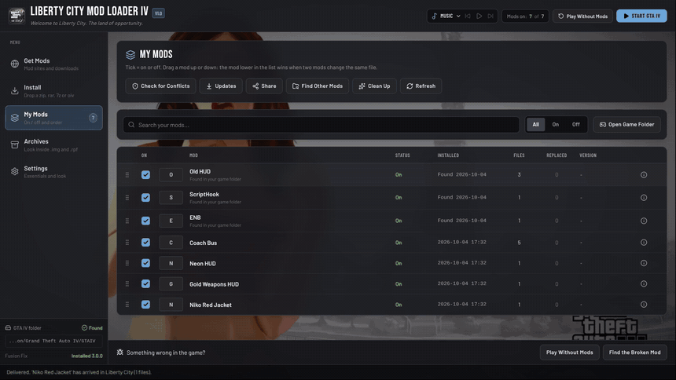

 

<table>
<tr>
<td width="50%" valign="top">

### 📦 Install in one click
Drop a **.zip .rar .7z .oiv** or a folder. The app shows where every file goes, then puts it there.
- Models and textures are packed for you
- `gta.dat`, car lines and trainer lists are added for you
- Warns you about missing tools before you install

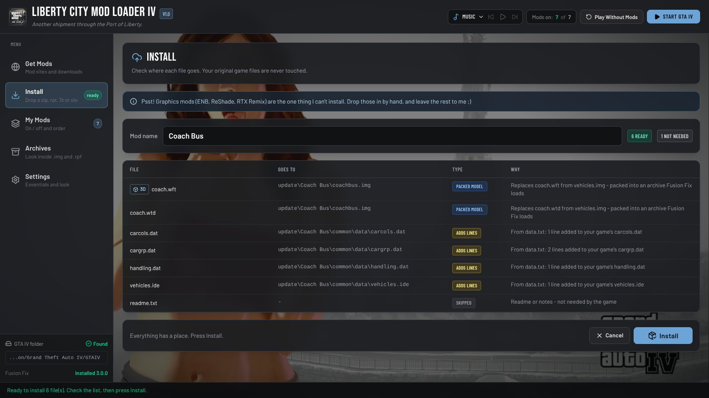

</td>
<td width="50%" valign="top">

### 🗂️ My Mods
Every mod in one list.
- **Tick** = on, **untick** = off. Nothing is deleted
- The mod **lower** in the list wins
- Updates from Nexus, share your list, find mods you installed by hand

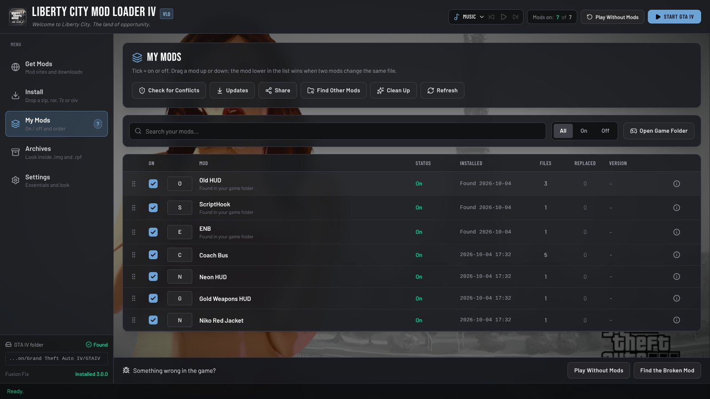

</td>
</tr>
<tr>
<td width="50%" valign="top">

### 🎨 Texture mixing
Two mods change different textures in the **same file** (like two HUD mods)? **Both work.**
Check for Conflicts shows you what was mixed.

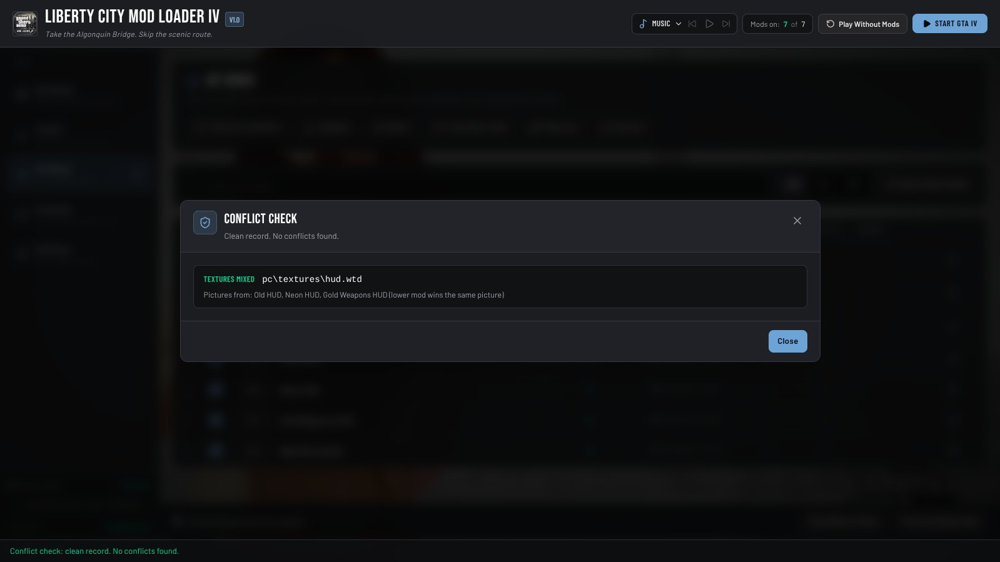

</td>
<td width="50%" valign="top">

### 🗄️ Game Archives
Look inside `.img` and `.rpf` files. Take files out, replace them or add new ones. See, save and replace the pictures in `.wtd` files.

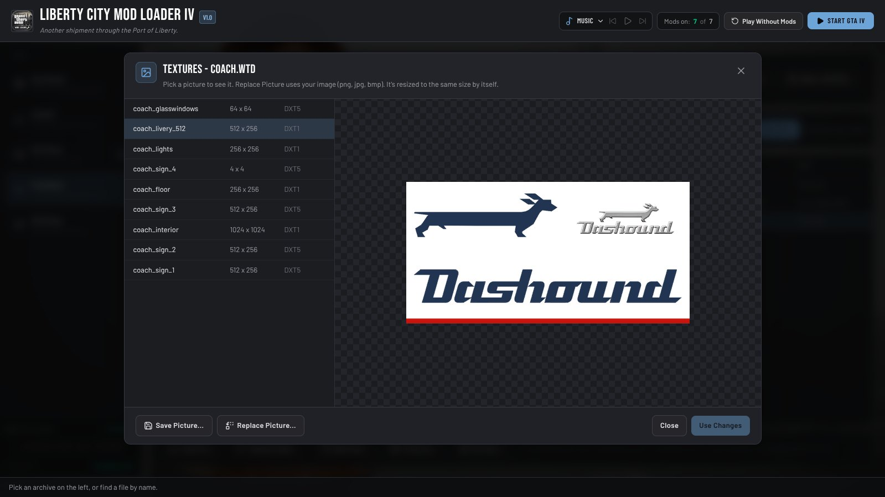

</td>
</tr>
<tr>
<td width="50%" valign="top">

### 🩺 Something wrong in the game?
- **Play Without Mods** - test the plain game, one click brings mods back
- **Find the Broken Mod** - answer a few questions, the app finds it
- **Clean Up** - removes files old mods left behind

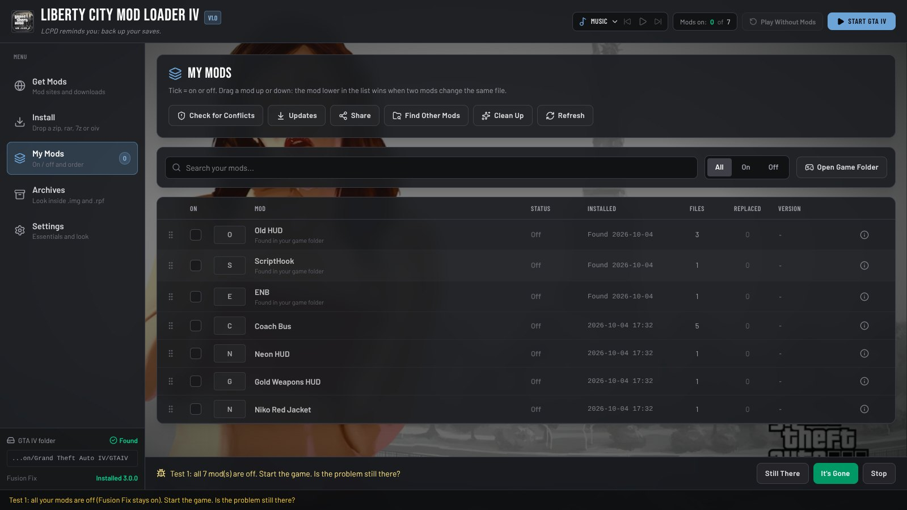

</td>
<td width="50%" valign="top">

### ⚙️ Settings & extras
- Fusion Fix settings in one place
- Links to essential tools (ScriptHookDotNet, DLSS-IV...)
- Built-in mod sites browser + Nexus **Mod Manager Download**
- Your own background and a music player 🎵

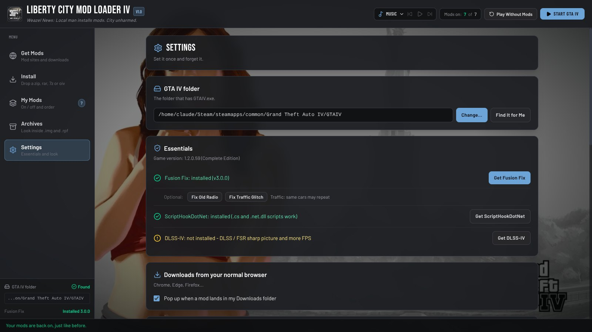

</td>
</tr>
</table>

 

See **cars** (`.wft`), **characters** (`.wdd`) and **objects** (`.wdr`) in 3D with their textures - right inside the app.
Turn them with the mouse, change the car paint, save a picture. Works in Game Archives, on the Install page (press **3D**) or with any model file.

<table>
<tr>
<td width="50%">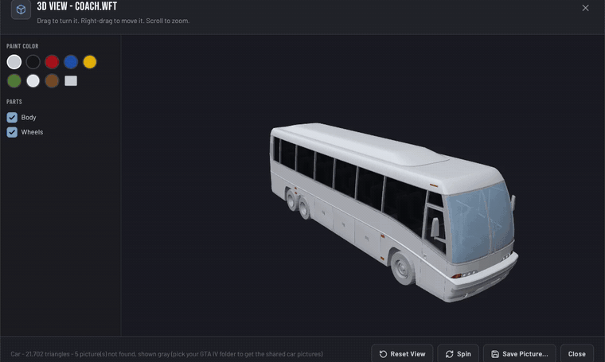</td>
<td width="50%">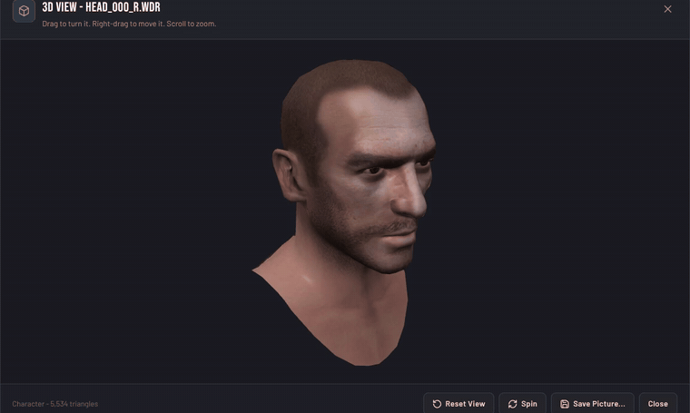</td>
</tr>
</table>

 

| | |
|:-:|:--|
| **1** | Download the zip from **[Releases](https://github.com/onegaming1231/LibertyCityModLoaderIV/releases)** or **[Nexus Mods](https://www.nexusmods.com/gta4/mods/1487)** |
| **2** | Unzip it anywhere (**not** inside the game folder) |
| **3** | Open **Liberty City Mod Loader IV.exe** - it finds GTA IV by itself |
| **4** | Go to **Install**, drop in a mod, press **Install**. Done! 🎉 |

**You need:** GTA IV: The Complete Edition (1.2.0.59) · [Fusion Fix](https://github.com/ThirteenAG/GTAIV.EFLC.FusionFix) · Windows 10 or 11 (64-bit) 
**Optional:** 7-Zip or WinRAR for `.7z` and `.rar` mods · a free Nexus Mods API key for update checks

 

<b>📸 Click to see all screenshots</b>

 

| | |
|:-:|:-:|
|  My Mods |  Check for Conflicts |
|  Install | 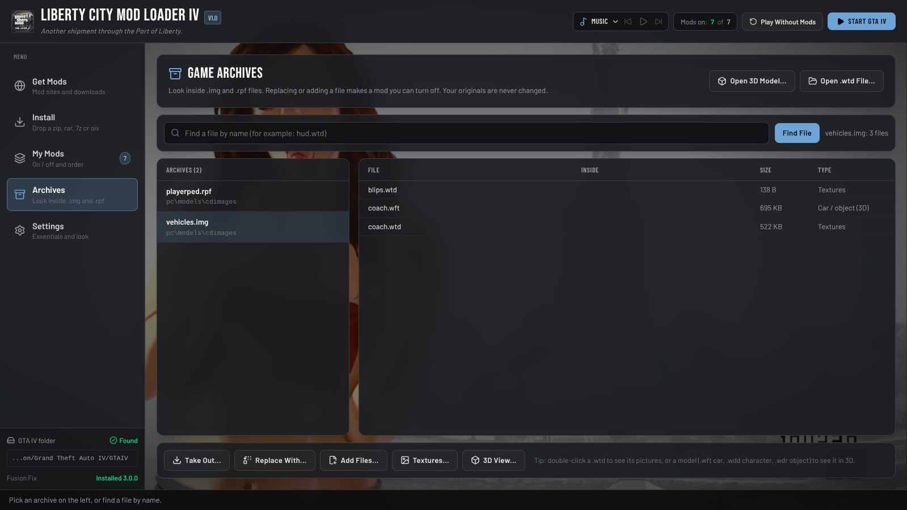 Game Archives |
|  Textures | 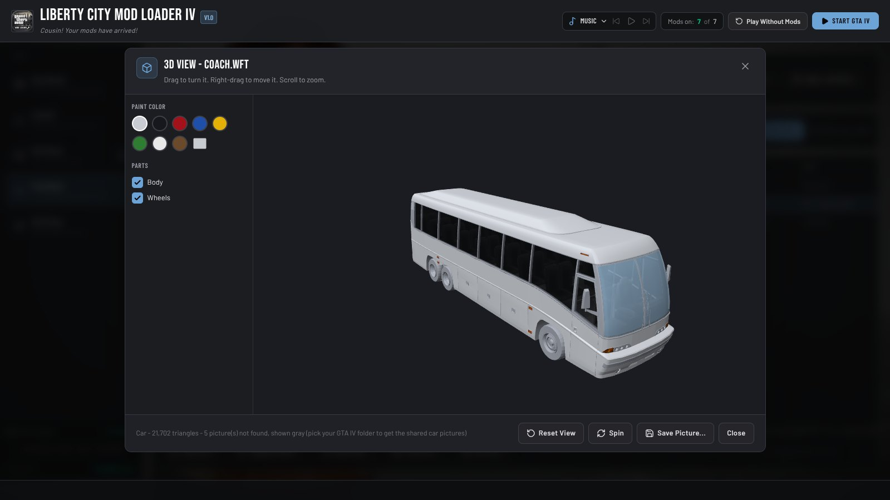 3D View - car |
| 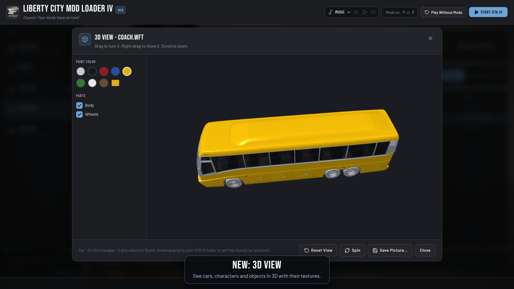 3D View - paint color | 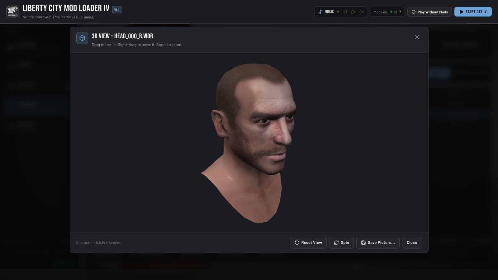 3D View - character |
|  Find the Broken Mod |  Settings |

 

<b>🕹️ How to use</b>

 

- **Install a mod** - drag the file onto the app, or use Choose File on the Install page. Check where the files go and press Install.
- **Download inside the app** - go to Get Mods, pick a site, press a download button. The mod opens in Install by itself.
- **Turn a mod off or on** - untick or tick it in My Mods. Nothing is deleted.
- **Remove a mod** - click it in My Mods and press Uninstall. Your original files come back.
- **Two mods change the same thing** - move the one you like more to the bottom of My Mods. The bottom one wins.
- **Game has a problem** - press Play Without Mods, or Find the Broken Mod and answer a few questions.
- **See a model in 3D** - double-click a car, character or object in Game Archives, or press Open 3D Model.

<b>🚫 What it can't do</b>

 

- Graphics mods (**ENB, ReShade, RTX Remix**) - install those by hand
- Mods with their own setup program (`.exe`) - run them yourself
- Steps a readme asks you to type by hand (like changing a number in handling.dat) - the app shows you those lines
- Made and tested for the Complete Edition **1.2.0.59** only

<b>🛡️ Is it safe?</b>

 

Yes. Scanned on VirusTotal: **0 / 64**. The `.exe` and `.dll` files are the official [Electron](https://www.electronjs.org/) files - only the name, icon, version info and Electron security settings (fuses) are changed. All the app's code is in this repository. Your original game files are never changed.

<b>🛠️ Build it yourself</b>

 

The app is [Electron](https://www.electronjs.org/) + a React window + an engine in plain JavaScript (`electron/engine`, no extra packages).

1. Install [Node.js](https://nodejs.org/) (LTS)
2. `npm install`
3. `node scripts/build.cjs` (needs the Tailwind CLI: `npx @tailwindcss/cli`, or set `TAILWIND=<path>`)
4. Run it: `npx electron .`
5. Make the app folder from the official Electron zip (`electron-v44.5.1-win32-x64.zip` from [Electron releases](https://github.com/electron/electron/releases)): 
   `node scripts/package.cjs electron-v44.5.1-win32-x64.zip out\LibertyCityModLoaderIV win`

Tests: `test/fixture.cjs` makes a fake GTA IV folder, `test/e2e.cjs` clicks through the app.

<b>🙏 Shout outs</b>

 

- **SparkIV** - by Aru, GitHub version by ahmed605 - texture and model code used under the GPL v3 license
- **Fusion Fix** - by ThirteenAG and contributors
- **ScriptHookDotNet** - by HazardX, Complete Edition version by Priler
- **DLSS-IV** - by ChunkLeChuck
- **Liberty's Legacy Trainer** - by konstantinos96b (add-on lists support)
- **Auto Shop** (extra mod) - based on IV Car Dealers by SixStarKing and Liberty City Customs by XxproxXgammer (fixed version by Schligen)
- **Electron** - the app frame
- **Background video** - "Lola Del Rio" live wallpaper from MoeWalls, art by Rockstar Games
- **Fonts** - Bebas Neue (Dharma Type) and Barlow (Jeremy Tribby), SIL Open Font License
- **Thanks** to everyone in the GTA IV modding community who keeps this game alive

<b>📄 License</b>

 

GPL v3 - see [LICENSE-GPL3.txt](LICENSE-GPL3.txt). Free and open source.

 

